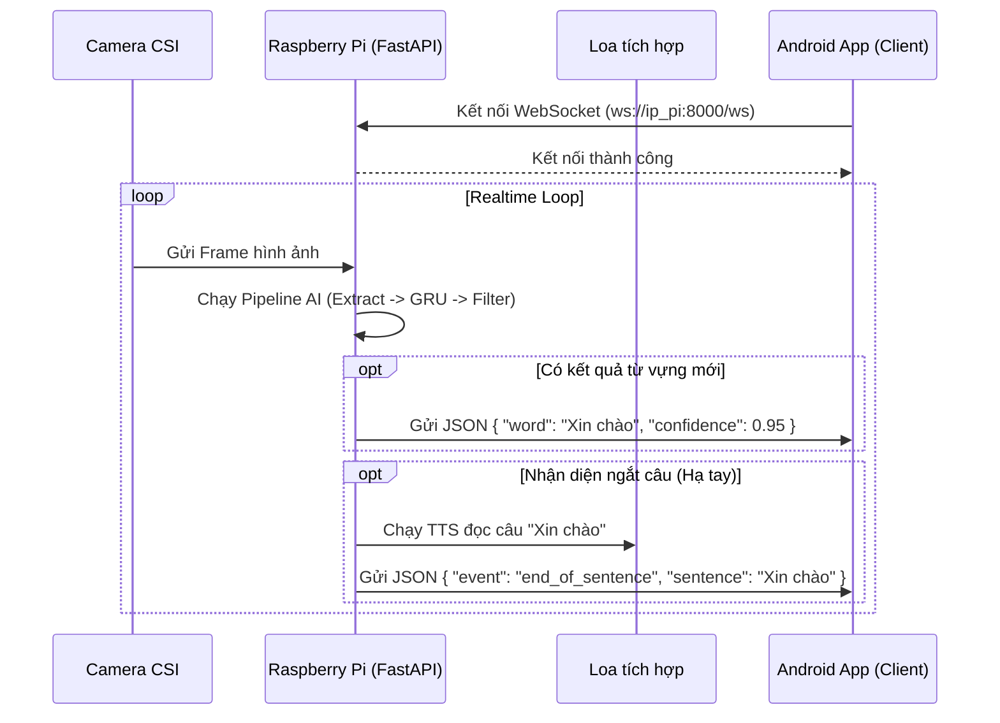

# TỔNG QUAN ĐỒ ÁN: KÍNH THÔNG MINH NHẬN DIỆN NGÔN NGỮ KÝ HIỆU TIẾNG VIỆT (VSL)

Tài liệu này mô tả chi tiết kiến trúc và thành phần của hệ thống Kính Thông Minh hỗ trợ giao tiếp cho người khiếm thính thông qua nhận diện ngôn ngữ ký hiệu tiếng Việt theo thời gian thực (Realtime Edge AI).

---

## 1. SƠ ĐỒ KHỐI TỔNG THỂ

Dưới đây là sơ đồ khối tổng thể mô tả luồng dữ liệu đi từ phần cứng thu nhận (Camera) qua các module phần mềm trên Raspberry Pi, cho đến đầu ra cuối cùng (Loa & App).

```text
[CAMERA OV5647] 
       │  (Dữ liệu hình ảnh thô 120° FOV)
       ▼
┌─────────────────────────────────────────────────────────────┐
│          RASPBERRY PI 4 (EDGE AI - OFFLINE FIRST)           │
│                                                             │
│  [1. THU NHẬN & TIỀN XỬ LÝ ẢNH]                             │
│   ├── Camera Capture (Picamera2 / libcamera)                │
│   └── Frame Preprocessing (Resize, Color Convert, FPS)      │
│         │                                                   │
│         ▼                                                   │
│  [2. TRÍCH XUẤT ĐẶC TRƯNG & CHUẨN HÓA]                      │
│   ├── MediaPipe Holistic (Ước lượng tư thế)                 │
│   ├── Landmark Selector (Trích xuất 48 điểm 3D cốt lõi)     │
│   └── Landmark Normalization (Tịnh tiến gốc, scale tỷ lệ)   │
│         │                                                   │
│         ▼                                                   │
│  [3. MÔ HÌNH HỌC SÂU (DEEP LEARNING)]                       │
│   ├── Temporal Sequence (Sliding Window 60 frames)          │
│   ├── TensorFlow Lite Inference (Mạng GRU tối ưu hóa)       │
│   └── Prediction (Phân loại N từ vựng - Cấu hình linh hoạt) │
│         │                                                   │
│         ▼                                                   │
│  [4. HẬU XỬ LÝ & TẠO CÂU (SENTENCE BUILDER)]                │
│   ├── Confidence Filter (Lọc độ tin cậy thấp)               │
│   ├── Debounce Filter (Chống nhiễu, chống lặp từ)           │
│   ├── Sentence Boundary Detection (Nhận diện ngắt câu)      │
│   └── Rule-based Builder (Ghép từ thành câu hoàn chỉnh)     │
│         │                                                   │
│         ▼                                                   │
│  [5. GIAO TIẾP ĐẦU RA]                                      │
│   ├── Text-to-Speech (Chuyển văn bản thành giọng nói)       │
│   └── FastAPI + WebSocket Server (Đẩy dữ liệu thời gian thực│
└─────────┬───────────────────────────┬───────────────────────┘
          │ (Âm thanh)                │ (Dữ liệu JSON/Text)
          ▼                           ▼
    [LOA TÍCH HỢP]              [ANDROID APP]
  (Phát âm tiếng Việt)       (Hiển thị Text & Lịch sử)
```

---

## 2. PIPELINE XỬ LÝ CHI TIẾT

Luồng xử lý bên trong bộ não trung tâm (Raspberry Pi 4) được thiết kế tinh gọn để đáp ứng nhu cầu **Realtime Edge AI**.

1. **Thu nhận Camera (`Picamera2 / libcamera`)**: Kết nối qua cổng CSI, lấy frame liên tục ở mức 15-30 FPS.
2. **Tiền xử lý Ảnh**: Giảm độ phân giải ảnh, chuyển đổi hệ màu sang RGB chuẩn bị cho mạng AI.
3. **MediaPipe Holistic**: Tracking khung xương người.
4. **Landmark Selector (48 điểm)**: Lấy đúng 42 điểm hai bàn tay + 6 điểm khung vai, khuỷu, cổ tay (Tổng cộng `144 features/frame`). Bỏ qua dữ liệu khuôn mặt và chân để tiết kiệm tài nguyên.
5. **Landmark Normalization**:
   - *Translation*: Lấy trung điểm 2 vai làm gốc tọa độ `(0, 0, 0)` để triệt tiêu sai số do vị trí đứng trong khung hình.
   - *Scale*: Chia tỷ lệ tất cả tọa độ bằng khoảng cách giữa 2 vai để triệt tiêu sai số do đứng xa/gần camera.
   - *Missing-Landmark*: Điền mảng zeros cho các điểm bị khuất (visibility thấp).
6. **Temporal Sequence Processing**: Thu thập các frame thành một "Cửa sổ trượt" (Sliding Window) 60 frames. 
7. **TensorFlow Lite (GRU Model)**: Dự đoán chuỗi 60 frames đó thuộc về từ vựng nào trong từ điển ngôn ngữ ký hiệu.
8. **Bộ Lọc (Filters)**:
   - *Confidence Filter*: Loại bỏ kết quả dự đoán thiếu tự tin (`< 85%`).
   - *Debounce Filter*: Nếu từ vựng giống hệt từ trước đó hoặc biến đổi liên tục trong thời gian ngắn, từ đó sẽ bị bỏ qua. Phải duy trì trong ít nhất 5 frames mới ghi nhận.
9. **Sentence Boundary Detection**: Dựa trên việc "hạ tay" (buông thõng hai tay ra khỏi khung hình trong > 15 frames) để xác định sự kết thúc của một câu dịch.
10. **Rule-based Sentence Builder**: Nối các từ lại thành một câu tiếng Việt hoàn chỉnh.
11. **Text-to-Speech (TTS)**: Đọc câu ra loa cho người đối diện nghe.

---

## 3. SƠ ĐỒ TRUYỀN THÔNG (COMMUNICATION)

Sơ đồ này thể hiện phương thức giao tiếp giữa module Kính (Raspberry Pi) và Thiết bị di động (Android). Cả hai kết nối qua mạng WiFi nội bộ (Không cần Internet) để bảo đảm bảo mật và độ trễ thấp nhất.



---

## 4. CHI TIẾT PHẦN CỨNG

Hệ thống được thiết kế hoàn toàn theo tiêu chí **Edge Computing** (Tự thân vận động, không đẩy ảnh lên Cloud).

| Linh kiện | Vai trò | Đặc tả cấu hình |
|---|---|---|
| **Raspberry Pi 4 Model B** | Bộ não trung tâm, xử lý AI, tạo WiFi Hotspot | RAM 8GB, CPU Broadcom BCM2711, Quad-core Cortex-A72 (ARM v8) 64-bit SoC @ 1.5GHz |
| **Camera Module (OV5647)** | Mắt cảm biến thu hình ảnh góc rộng | 5 Megapixels, Giao tiếp cổng CSI chuyên dụng, Góc nhìn (FOV) 120 độ |
| **Loa (Speaker Mini)** | Giao tiếp âm thanh | Kết nối qua cổng Audio 3.5mm hoặc Bluetooth, phát TTS tiếng Việt |
| **Kính (Khung In 3D)** | Khung bám thân thể | Khung gắn Camera ở chính giữa hoặc một bên, có hộp kỹ thuật chứa Pi đeo bên hông. |

> **Lưu ý:** Ban đầu có thiết kế Màn hình HUD gắn trên kính, nhưng sau khi cân nhắc về tải năng lượng và trọng lượng trên mắt người khiếm thính, nhóm đã loại bỏ HUD và đẩy màn hình hiển thị phụ về Điện thoại Android.

---

## 5. CHI TIẾT PHẦN MỀM

Hệ thống phần mềm được chia làm 2 khối chính: **Khối AI trên Pi** và **Khối Ứng dụng trên Android**.

### 5.1. Khối AI (Raspberry Pi 4)
- **Hệ điều hành**: Raspberry Pi OS (64-bit) / Ubuntu Server.
- **Ngôn ngữ**: Python 3.9+.
- **Thư viện AI cốt lõi**:
  - `mediapipe`: Trích xuất khung xương (Holistic).
  - `tensorflow-lite` (tflite-runtime): Chạy mô hình GRU inference siêu nhẹ.
  - `opencv-python`: Tiền xử lý ma trận ảnh và resize.
  - `numpy`: Xử lý mảng và toán học (Landmark Normalization).
- **Thư viện Giao tiếp**:
  - `fastapi` + `uvicorn`: Tạo REST API và WebSocket Server.
- **Thư viện Âm thanh**:
  - `gTTS` (hoặc pyttsx3 offline) để phát giọng nói.

### 5.2. Khối Ứng dụng (Android App) - chưa xác định cụ thể
- **Ngôn ngữ**: Kotlin.
- **Kiến trúc UI**: Jetpack Compose (Modern UI Toolkit).
- **Thư viện giao tiếp**: OkHttp / Ktor Client (hỗ trợ WebSocket).
- **Chức năng chính**:
  - Tự động dò tìm IP của kính trong mạng nội bộ.
  - Hiển thị trực tiếp các từ vựng đang được dịch (Subtitles / Captions).
  - Lưu lại lịch sử hội thoại dạng chat.
  - Hỗ trợ nhập Text để chuyển thành âm thanh (chiều ngược lại cho người khiếm thính).
