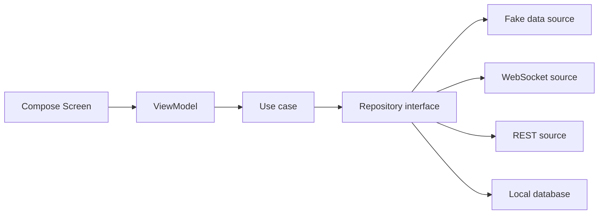
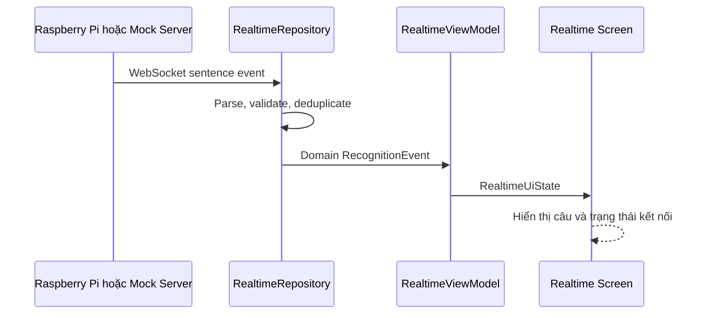

# Kế hoạch triển khai Android App-first

> Trạng thái: **Planned**  
> Cập nhật: 2026-07-19

## Mục tiêu

Xây dựng Android companion app hoàn chỉnh trước khi Raspberry Pi API sẵn sàng, nhưng giữ đúng ranh giới: Android không xử lý MediaPipe, GRU hoặc TFLite. App được phát triển trên `FakeRepository` và dữ liệu WebSocket giả lập, sau đó thay adapter bằng API thật mà không viết lại UI/domain.

Mục tiêu gần nhất là có một **MVP chạy được trên điện thoại** với ba khả năng:

1. Hiển thị câu nhận diện thời gian thực từ nguồn dữ liệu giả lập.
2. Thể hiện chính xác trạng thái kết nối Raspberry Pi.
3. Lưu và xem lịch sử hội thoại cục bộ.

## Phạm vi

### MVP bắt buộc

- Single-activity Jetpack Compose.
- Navigation và design system cơ bản.
- Màn hình Realtime Subtitle.
- Kết nối WebSocket có reconnect.
- Chế độ Demo/Fake Data để phát triển khi chưa có Pi.
- Lịch sử hội thoại cục bộ.
- Màn hình thiết lập địa chỉ Pi và trạng thái thiết bị.
- Unit test cho ViewModel/repository/parser và UI test cho luồng chính.

### Sau MVP

- Giao tiếp ngược Speech-to-Text trên Android.
- Debug dashboard: FPS, latency, model version, nhiệt độ và trạng thái Pi.
- Model update UI, chỉ gửi yêu cầu; Pi tự xác minh và kích hoạt model.
- Cấu hình camera/AI được Pi công bố qua API.
- Export/xóa lịch sử và hoàn thiện accessibility.

### Không thuộc Android

- MediaPipe, landmark extraction và normalization.
- GRU/TFLite inference.
- Sentence Builder.
- TTS/loa chính trên thiết bị kính.
- Train, convert hoặc trực tiếp kích hoạt model.

## Kiến trúc

Áp dụng kiến trúc feature-first, unidirectional data flow:



Các interface phải được tạo trước implementation mạng:

```kotlin
interface RealtimeRepository {
    fun observeConnection(): Flow<ConnectionState>
    fun observeRecognition(): Flow<RecognitionEvent>
    suspend fun connect(endpoint: DeviceEndpoint)
    suspend fun disconnect()
}
```

`FakeRealtimeRepository` và `PiRealtimeRepository` cùng triển khai interface này. ViewModel và Composable không được biết OkHttp, DTO hoặc địa chỉ IP.

## Kế hoạch thực hiện

### Phase 0 — Làm sạch nền build

**Ưu tiên:** Blocker  
**Thời lượng dự kiến:** 1–2 ngày

Công việc:

- Chọn bộ phiên bản Gradle/AGP/Kotlin/Compose tương thích; hiện wrapper 9.4.1 đang xung đột plugin/configuration cache.
- Thêm `MainActivity` và khai báo launcher activity trong manifest.
- Thay theme XML template không phù hợp bằng Compose Material 3 theme.
- Thiết lập package/module cơ bản và build variants `debug`/`release`.
- Bổ sung lint và test command chuẩn.

Đầu ra:

- App mở được trên emulator/điện thoại.
- `assembleDebug`, unit test và lint chạy thành công.
- Không còn test template vô nghĩa được tính là test nghiệp vụ.

### Phase 1 — App shell, navigation và design system

**Ưu tiên:** P0  
**Thời lượng dự kiến:** 2–3 ngày

Công việc:

- Tạo package `core`, `designsystem`, `data`, `domain`, `feature`.
- Tạo `AppState`, navigation graph và top-level destinations.
- Xây token màu, typography, spacing, status component và dark mode.
- Tạo màn hình placeholder: Realtime, History, Device và Settings.

Đầu ra:

- Điều hướng ổn định giữa bốn màn hình.
- UI hỗ trợ font scaling và trạng thái kết nối không chỉ biểu diễn bằng màu.

### Phase 2 — Realtime MVP bằng FakeRepository

**Ưu tiên:** P0  
**Thời lượng dự kiến:** 3–4 ngày

Công việc:

- Tạo domain model `RecognitionEvent`, `Sentence`, `ConnectionState`, `Telemetry`.
- Tạo `FakeRealtimeRepository` phát chuỗi gloss/câu theo thời gian.
- Xây `RealtimeViewModel` bằng `StateFlow` và immutable `RealtimeUiState`.
- Thiết kế Realtime Screen: câu hiện tại cỡ lớn, gloss mới nhất, confidence, timestamp và connection chip.
- Hỗ trợ loading, empty, connected, reconnecting, disconnected và protocol error.

Đầu ra:

- Demo được toàn bộ UI không cần Raspberry Pi.
- Fake event “Tôi / muốn / uống / nước” tạo câu “Tôi muốn uống nước.”
- Xoay màn hình hoặc process recreation không làm mất state cần giữ.

### Phase 3 — Khóa protocol và tích hợp WebSocket

**Ưu tiên:** P0  
**Thời lượng dự kiến:** 4–5 ngày

Công việc:

- Chốt envelope JSON version 1 và payload `hello`, `connection`, `prediction`, `sentence`, `telemetry`, `error`.
- Tạo DTO, parser, mapper và protocol fixtures.
- Tích hợp OkHttp WebSocket trong data layer.
- Thêm heartbeat, timeout, exponential backoff và manual reconnect.
- Dedupe bằng `event_id`; bỏ qua optional field chưa biết; báo lỗi version không tương thích.
- Tạo mock WebSocket server/test fixture để kiểm tra mà không cần Pi.

Đầu ra:

- App chuyển giữa Fake và WebSocket source bằng cấu hình, không đổi UI.
- Ngắt mạng rồi bật lại: app reconnect, không nhân đôi câu lịch sử.
- Không hard-code địa chỉ Pi trong source UI.

### Phase 4 — History và local persistence

**Ưu tiên:** P1  
**Thời lượng dự kiến:** 3–4 ngày

Công việc:

- Thêm Room hoặc persistence abstraction cho conversation/session.
- Lưu accepted sentence, thời gian, confidence tổng hợp và device/session id.
- Xây History list, Conversation Detail, xóa một mục và xóa toàn bộ có xác nhận.
- Định nghĩa retention; mặc định không lưu video/frame/landmark.

Đầu ra:

- Lịch sử còn sau khi đóng/mở app.
- Duplicate `event_id` không sinh duplicate record.
- Người dùng có thể xóa dữ liệu cục bộ rõ ràng.

### Phase 5 — Device và Settings

**Ưu tiên:** P1  
**Thời lượng dự kiến:** 3–4 ngày

Công việc:

- Thiết lập host/port, lưu endpoint và kiểm tra kết nối.
- Hiển thị capability, model version, uptime, pin/nhiệt độ nếu Pi cung cấp.
- Tách cấu hình local của app khỏi cấu hình runtime của Pi.
- Thêm REST client cho health/status/config với typed error.

Đầu ra:

- Người dùng cấu hình Pi mà không sửa code.
- Setting không được Pi hỗ trợ sẽ bị ẩn/disable theo capability response.

### Phase 6 — Speech-to-Text giao tiếp ngược

**Ưu tiên:** P2  
**Thời lượng dự kiến:** 3–5 ngày

Công việc:

- Xin quyền microphone đúng thời điểm.
- Chuyển lời người nghe thành văn bản lớn để người khiếm thính đọc.
- Hỗ trợ xoay màn hình/landscape presentation.
- Phân biệt rõ STT Android với pipeline dịch ký hiệu trên Pi.
- Đánh dấu rõ nếu STT engine cần Internet; không được làm ảnh hưởng pipeline Pi.

Đầu ra:

- Có thể trình diễn hội thoại hai chiều cơ bản.
- Từ chối quyền microphone không làm crash hoặc khóa phần realtime subtitle.

### Phase 7 — Debug, model update UI và hardening

**Ưu tiên:** P2  
**Thời lượng dự kiến:** 4–6 ngày

Công việc:

- Debug dashboard, log viewer đã lọc dữ liệu nhạy cảm.
- Model update flow: chọn gói/gửi yêu cầu/theo dõi operation/hiển thị rollback; Pi quyết định activation.
- Accessibility, Vietnamese copy, empty/error states và performance profiling.
- Test reconnect dài hạn, background/foreground, Doze, endpoint sai và schema sai.
- Chuẩn bị release signing/config nhưng không commit secret.

Đầu ra:

- Release candidate đủ cho demo tích hợp Pi.
- Không có AI inference trong APK.
- App lỗi hoặc bị tắt không làm ảnh hưởng hoạt động của Pi.

## Luồng hoạt động

Luồng phát triển được thực hiện theo vertical slice:

1. Domain model và repository interface.
2. Fake data fixture.
3. ViewModel/UiState.
4. Compose screen.
5. Unit/UI test.
6. Network/local adapter thật.
7. Cập nhật API docs và trạng thái implementation.

Luồng runtime MVP:



## Thứ tự màn hình

| Thứ tự | Màn hình | MVP | Lý do |
|---:|---|---|---|
| 1 | Realtime Subtitle | Có | Giá trị chính của companion app |
| 2 | Device Connection | Có | Cần để kết nối Pi/mock server |
| 3 | History | Có | Yêu cầu sản phẩm và demo |
| 4 | Settings | Có | Endpoint và tùy chọn local |
| 5 | Reverse STT | Sau MVP | Hỗ trợ hội thoại hai chiều |
| 6 | Debug Dashboard | Sau MVP | Phục vụ tích hợp/benchmark |
| 7 | Model Update | Sau MVP | Phụ thuộc API/update flow của Pi |

## Ví dụ

Trong Phase 2, app chạy bằng `FakeRealtimeRepository`. Khi Phase 3 hoàn tất, chỉ thay binding sang `PiRealtimeRepository`; `RealtimeViewModel`, `RealtimeUiState` và `RealtimeScreen` không thay đổi.

Khi Android mất kết nối:

- Giữ câu cuối cùng nhưng đánh dấu dữ liệu đã cũ.
- Hiển thị `Đang kết nối lại` và thời điểm nhận cuối.
- Không tự tạo kết quả giả khi đang ở chế độ production.
- Không gửi bất kỳ yêu cầu nào có thể dừng inference trên Pi.

## Tiêu chí hoàn thành MVP

- Build, lint và test chạy thành công trên môi trường phát triển chuẩn.
- Không có MediaPipe/TensorFlow/TFLite dependency trong Android app.
- Realtime UI chạy được với fake source và mock WebSocket.
- Reconnect không làm duplicate sentence.
- Lịch sử tồn tại sau khi restart app.
- Mất mạng được thể hiện rõ, không crash.
- Không lưu video/frame/landmark mặc định.
- Tất cả interface và JSON fixture có test.
- Documentation và trạng thái được cập nhật theo source thực tế.

## Ghi chú triển khai

- Chưa làm CameraX ở MVP. Camera preview chỉ được thêm khi Pi cung cấp stream và nhóm xác nhận use case debug.
- Không bắt đầu bằng việc làm toàn bộ UI tĩnh. Mỗi màn hình phải đi cùng UiState, fake repository và test để sẵn sàng tích hợp.
- Không phụ thuộc discovery tự động trong giai đoạn đầu; nhập endpoint thủ công ổn định hơn. Có thể thêm mDNS sau khi MVP hoạt động.
- Không triển khai model update trước khi có ModelBundle contract, checksum, compatibility và rollback API.
- Mỗi phase chỉ chuyển sang **Implemented** khi có source và test evidence tương ứng.

## Tài liệu liên quan

- [README.md](README.md)
- [ANDROID_ARCHITECTURE.md](ANDROID_ARCHITECTURE.md)
- [FOLDER_STRUCTURE.md](FOLDER_STRUCTURE.md)
- [NAVIGATION.md](NAVIGATION.md)
- [SCREEN_SPECIFICATIONS.md](SCREEN_SPECIFICATIONS.md)
- [DATA_FLOW.md](DATA_FLOW.md)
- [REPOSITORY_PATTERN.md](REPOSITORY_PATTERN.md)
- [../05_API/WEBSOCKET.md](../05_API/WEBSOCKET.md)
- [../05_API/JSON_SCHEMA.md](../05_API/JSON_SCHEMA.md)
- [../06_Testing/TEST_PLAN.md](../06_Testing/TEST_PLAN.md)
- [../99_Decisions/ADR-001.md](../99_Decisions/ADR-001.md)
- [../99_Decisions/ADR-004.md](../99_Decisions/ADR-004.md)
