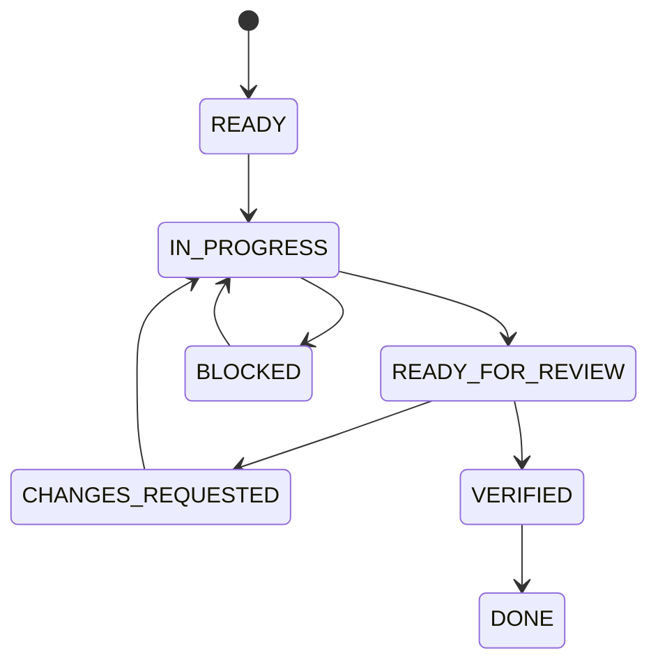

# Workflow phối hợp Antigravity, Kilo Code và Android Studio Agent

> Trạng thái: **Implemented**  
> Cập nhật: 2026-09-21

## Mục tiêu

Giúp các AI agent cùng làm việc trên một repository mà không trùng nhiệm vụ, ghi đè source, tự thay đổi kiến trúc hoặc báo hoàn thành thiếu bằng chứng.

Nguyên tắc trung tâm là **mỗi task chỉ có một agent được phép sửa source tại một thời điểm**. Agent còn lại đóng vai trò độc lập review, kiểm tra hoặc chuẩn bị nhiệm vụ không đụng vào cùng file.

## Phạm vi

Workflow áp dụng cho toàn bộ Android, Raspberry Pi, AI pipeline, API, testing và documentation:
- **Antigravity**: Đóng vai trò là Planner & Implementer cho hệ thống (Core AI, Raspberry Pi, Backend/Nhúng, tạo Task Card, code và chạy kiểm thử nội bộ QC-1).
- **Kilo Code**: Đóng vai trò là Independent Reviewer & QA (Thẩm định độc lập, chạy lệnh kiểm tra, đối chiếu các điều cấm DO NOTs và xuất `qc_report.md`).
- **Android Studio Agent**: Triển khai chuyên biệt cho ứng dụng Android Companion App.

## Kiến trúc

### Phân định vai trò

| Agent | Vai trò chính | Được sửa gì | Không nên làm / Giới hạn |
|---|---|---|---|
| **Antigravity** | **Planner & Implementer** | Tạo Task Card, viết code Raspberry Pi/AI/Backend, docs, ADR, sửa code và test nội bộ QC-1 | Không bỏ qua bước bàn giao kiểm thử độc lập cho Kilo Code |
| **Kilo Code** | **Independent Reviewer & QA** | Thẩm định độc lập qua `agent_for_kilo.md`, chạy lệnh test/lint, ghi nhận xét vào `qc_report.md` | Không tự ý can thiệp sửa trực tiếp source code khi đang trong lượt review của task |
| **Android Studio Agent** | **Primary Android Implementer** | Gradle, Kotlin, Compose, resources, Android unit/instrumented tests | Không tự đổi ADR/API contract hoặc vi phạm ranh giới Edge AI |

---

### Nguồn trạng thái task

Mỗi task có một file handoff tại:

```text
docs/08_Agents/tasks/TASK-<số>-<tên-ngắn>.md
```

File này là nơi duy nhất ghi:

- Mục tiêu task.
- Agent đang sở hữu task (Owner: Antigravity / Android Studio Agent).
- File được phép sửa (`Allowed scope`).
- File không được sửa (`Forbidden scope`).
- Tiêu chuẩn nghiệm thu (`Acceptance Criteria`).
- Lệnh build/test bắt buộc (`Verification commands`).
- Kết quả bàn giao và review.

---

### Trạng thái task



Ý nghĩa:

- `READY`: Phạm vi và acceptance criteria đã rõ ràng, chưa có agent code.
- `IN_PROGRESS`: Chỉ Owner được sửa các file trong scope.
- `READY_FOR_REVIEW`: Owner hoàn tất code + test nội bộ QC-1, tạo file `agent_for_kilo.md` và dừng sửa.
- `CHANGES_REQUESTED`: Kilo Code phát hiện lỗi, ghi vào `qc_report.md` (FAIL); Owner sửa tiếp.
- `VERIFIED`: Kilo Code kiểm tra đạt toàn bộ, ghi `PASS` vào `qc_report.md`.
- `DONE`: Cập nhật docs/trạng thái hoàn thành và đóng task.
- `BLOCKED`: Có vấn đề nghẽn cần sự can thiệp từ người dùng.

---

## Luồng hoạt động chi tiết

### Bước 1 — Antigravity lập kế hoạch & Tạo Task Card (Planner)
- Antigravity phân tích yêu cầu từ người dùng, tạo hoặc tham chiếu Task Card chuẩn trong `docs/08_Agents/tasks/` theo `TASK_TEMPLATE.md`.
- Xác định rõ `Allowed scope`, `Forbidden scope` và tiêu chí nghiệm thu (`Acceptance Criteria`).

### Bước 2 — Triển khai mã nguồn & QC-1 Nội bộ (Implementer)
- Antigravity (hoặc Android Studio Agent đối với app Android) tiến hành code đúng trong phạm vi cho phép.
- Chạy các câu lệnh kiểm thử tự động (pytest, build, lint...) và ghi nhận kết quả.
- Đạt kiểm thử nội bộ **QC-1 First**.

### Bước 3 — Bàn giao kiểm thử sang Kilo Code
- Antigravity tạo/cập nhật file [agent_for_kilo.md](file:///d:/do_an_tot_nghiep/agent_for_kilo.md) ở thư mục gốc chứa:
  - Danh sách các file vừa sửa.
  - Tóm tắt thay đổi và mục tiêu.
  - Hướng dẫn cụ thể để Kilo Code thẩm định độc lập.
- Antigravity tự động kích hoạt Kilo CLI chạy ngầm (`kilo.exe run`) để chuyển giao task thẩm định mà không cần người dùng thao tác thủ công.

### Bước 4 — Kilo Code thẩm định độc lập & QA (Reviewer)
- Kilo Code đọc `agent_for_kilo.md`, thực thi kiểm tra độc lập:
  - Kiểm tra logic, lỗi tiềm ẩn, edge cases, bảo mật, định dạng.
  - Đối chiếu danh sách các điều cấm (**DO NOTs**): Ranh giới Edge AI (kính không màn hình ADR-004, RPi xử lý 100% offline ADR-001, không chuyển AI sang Android).
  - Chạy lệnh test kiểm chứng nếu cần.
- Kilo Code ghi kết quả đánh giá vào [qc_report.md](file:///d:/do_an_tot_nghiep/qc_report.md):
  - Nếu **FAIL**: Ghi rõ file lỗi, loại lỗi, nguyên nhân và đề xuất khắc phục.
  - Nếu **PASS**: Ghi đúng một chữ `PASS`.

### Bước 5 — Nghiệm thu, Báo cáo & Hoàn tất (Giới hạn 1 Chu kỳ)
- Antigravity đọc kết quả trong `qc_report.md`:
  - Nếu là `PASS`: Task chính thức hoàn thành và đóng task (`DONE`).
  - Nếu là `FAIL`: Antigravity phân tích nguyên nhân lỗi, đưa ra giải pháp đề xuất và báo cáo chi tiết cho Người dùng duyệt.
- **Giới hạn chu kỳ:** Chu kỳ khép kín dừng lại tại đây để Người dùng xem xét, tránh vòng lặp phản biện vô tận.

---

## Quy tắc chuyển Owner

Nếu muốn chuyển quyền sửa code giữa các Agent:
1. Owner hiện tại phải dừng sửa và lưu trạng thái rõ ràng.
2. Cập nhật trường `Owner` trong Task Card.
3. Ghi rõ commit/file state hoặc danh sách thay đổi.
4. Agent mới tiếp nhận đọc kỹ handoff trước khi thực thi.

Tuyệt đối không gửi cùng một prompt sửa code cho cả hai agent cùng lúc.

---

## Tài liệu liên quan

- [../../agent_for_kilo.md](../../agent_for_kilo.md)
- [../../AGENTS.md](../../AGENTS.md)
- [../../AGENT_START.md](../../AGENT_START.md)
- [TASK_QUEUE.md](TASK_QUEUE.md)
- [TASK_TEMPLATE.md](TASK_TEMPLATE.md)
