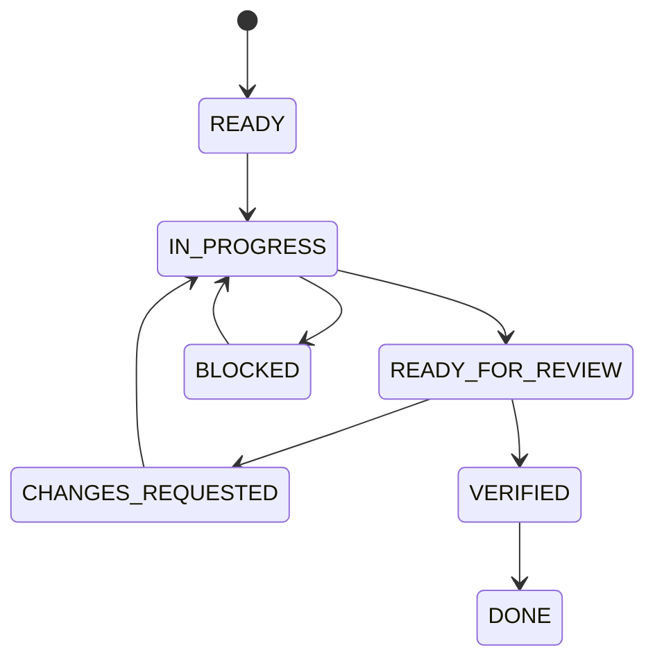

# Workflow phối hợp Codex, Antigravity và Android Studio Agent

> Trạng thái: **Implemented**  
> Cập nhật: 2026-07-19

## Mục tiêu

Giúp ba agent cùng làm việc trên một repository mà không trùng nhiệm vụ, ghi đè source, tự thay đổi kiến trúc hoặc báo hoàn thành thiếu bằng chứng.

Nguyên tắc trung tâm là **mỗi task chỉ có một agent được phép sửa source tại một thời điểm**. Hai agent còn lại chỉ review, kiểm tra hoặc chuẩn bị nhiệm vụ không đụng vào cùng file.

## Phạm vi

Workflow áp dụng cho toàn bộ Android, Raspberry Pi, AI, API, testing và documentation. Trong giai đoạn app-first, Android Studio Agent là người triển khai Android mặc định; Codex quản lý kiến trúc/tài liệu/task; Antigravity review độc lập.

## Kiến trúc

### Vai trò mặc định

| Agent | Vai trò chính | Được sửa gì | Không nên làm đồng thời |
|---|---|---|---|
| Codex | Lead Architect + Task Coordinator | Docs, ADR, API contract; source khi được giao riêng | Không sửa cùng source file khi Android Studio Agent đang code |
| Android Studio Agent | Primary Android Implementer | Gradle, Kotlin, Compose, resources, Android tests | Không tự đổi ADR/API/Edge AI boundary |
| Antigravity | Independent Reviewer + QA | Review, static analysis, test proposal; chỉ sửa khi task chuyển quyền | Không refactor trong lúc Android Studio Agent chưa bàn giao |

Codex có quyền code, nhưng trong workflow app-first nên giữ Codex ở vai trò kiến trúc và review cuối để tránh hai người cùng viết Android.

### Nguồn trạng thái task

Mỗi task có một file handoff tại:

```text
docs/08_Agents/tasks/TASK-<số>-<tên-ngắn>.md
```

File này là nơi duy nhất ghi:

- Mục tiêu task.
- Agent đang sở hữu task.
- File được phép sửa.
- File không được sửa.
- Acceptance criteria.
- Lệnh build/test bắt buộc.
- Kết quả bàn giao và review.

### Trạng thái task



Ý nghĩa:

- `READY`: phạm vi và acceptance đã rõ, chưa có agent code.
- `IN_PROGRESS`: chỉ Owner được sửa các file trong scope.
- `READY_FOR_REVIEW`: Owner dừng sửa và bàn giao bằng chứng.
- `CHANGES_REQUESTED`: Reviewer nêu lỗi cụ thể; Owner sửa tiếp.
- `VERIFIED`: build/test/review đạt.
- `DONE`: Codex cập nhật docs/trạng thái và đóng task.
- `BLOCKED`: có blocker có bằng chứng; không dùng cho việc đơn thuần chưa xong.

## Luồng hoạt động

### Bước 1 — Codex tạo task

Codex đọc roadmap/implementation plan và tạo một task đủ nhỏ, thường tương ứng một phase hoặc một vertical slice. Task phải ghi rõ Owner, Reviewer, file scope và Definition of Done.

Ví dụ cho Phase 0:

```text
Owner: Android Studio Agent
Reviewer: Antigravity
Architect/Approver: Codex
Allowed scope: Androi_App/** và docs Android liên quan
Forbidden: source Pi, AI architecture, MQTT/TFLite dependency
```

### Bước 2 — Android Studio Agent triển khai

Agent phải:

1. Đọc `AGENTS.md`, task handoff và tài liệu được task chỉ định.
2. Kiểm tra trạng thái source trước khi sửa.
3. Chỉ sửa file trong allowed scope.
4. Chạy build/test/lint đã quy định.
5. Ghi danh sách file sửa, quyết định kỹ thuật và kết quả lệnh vào task handoff.
6. Chuyển trạng thái sang `READY_FOR_REVIEW` rồi dừng sửa.

### Bước 3 — Antigravity review

Antigravity không sửa source ở lượt review đầu. Reviewer kiểm tra:

- Build/test evidence có thật và đủ không.
- Code có đúng task, architecture và Android conventions không.
- Có đưa AI/TTS chính/Sentence Builder nhầm sang Android không.
- Có hard-code IP, telemetry hoặc mock data vào production không.
- State, lifecycle, coroutine, error và accessibility có ổn không.
- Có file ngoài scope bị sửa không.

Nếu có lỗi, ghi từng lỗi với file/dòng/mức độ và chuyển `CHANGES_REQUESTED`. Không tự refactor thay Owner.

### Bước 4 — Android Studio Agent sửa review

Owner chỉ xử lý các comment đã xác nhận, chạy lại toàn bộ verification và bàn giao lần nữa. Không mở rộng feature trong lượt sửa review.

### Bước 5 — Codex nghiệm thu

Codex kiểm tra:

- Acceptance criteria.
- Boundary Edge AI và ADR.
- API/schema/documentation consistency.
- Kết quả build/test cuối cùng.
- Trạng thái `Planned`, `Implemented`, `Need Verification` có đúng bằng chứng.

Sau đó Codex cập nhật docs/roadmap và chuyển task `DONE`.

### Quy tắc chuyển Owner

Nếu muốn Codex hoặc Antigravity trực tiếp sửa code:

1. Owner hiện tại phải dừng và bàn giao.
2. Task handoff đổi trường `Owner`.
3. Ghi rõ commit/file state hoặc danh sách thay đổi chưa commit.
4. Owner mới đọc lại handoff trước khi sửa.

Không được gửi cùng một prompt code cho hai agent cùng lúc.

## Ví dụ

Workflow Phase 0 Android:

```text
Codex
  -> tạo TASK-001, giao Android Studio Agent sửa Gradle/MainActivity

Android Studio Agent
  -> sửa source
  -> chạy assembleDebug, test, lint
  -> ghi evidence
  -> READY_FOR_REVIEW

Antigravity
  -> review toolchain, manifest, source và test
  -> CHANGES_REQUESTED hoặc VERIFIED

Codex
  -> kiểm tra boundary/docs
  -> cập nhật IMPLEMENTATION_PLAN
  -> DONE
```

Prompt ngắn dùng cho mọi agent:

```text
Trước khi làm việc, đọc AGENTS.md và file task handoff được giao.
Chỉ làm đúng vai trò Owner/Reviewer/Approver ghi trong task.
Không sửa file ngoài Allowed scope.
Không bắt đầu nếu task đang IN_PROGRESS bởi agent khác.
Mọi kết quả phải kèm lệnh build/test và bằng chứng cụ thể.
```

## Ghi chú triển khai

- Dùng một task nhỏ cho mỗi phase; không dùng task “xây toàn bộ app”.
- Nếu không dùng Git branch riêng, quy tắc single-writer càng bắt buộc.
- Không đánh dấu `DONE` chỉ vì UI nhìn đẹp; phải đạt acceptance và test.
- Mock/Fake implementation chỉ chứng minh app layer; không được dùng để đánh dấu Pi/API production là `Implemented`.
- Khi Agent phát hiện yêu cầu mới, ghi đề xuất vào handoff. Chỉ Codex/ADR mới được đổi kiến trúc chính thức.
- Người dùng là người có quyền quyết định cuối cùng; xác nhận của người dùng phải được Codex ghi lại trong ADR/docs.

## Tài liệu liên quan

- [../../AGENT_START.md](../../AGENT_START.md)
- [TASK_QUEUE.md](TASK_QUEUE.md)
- [TASK_TEMPLATE.md](TASK_TEMPLATE.md)
- [SESSION_START_PROMPTS.md](SESSION_START_PROMPTS.md)
- [PROMPT_LIBRARY.md](PROMPT_LIBRARY.md)
- [CODEX.md](CODEX.md)
- [ANTIGRAVITY.md](ANTIGRAVITY.md)
- [GEMINI.md](GEMINI.md)
- [../04_Android/IMPLEMENTATION_PLAN.md](../04_Android/IMPLEMENTATION_PLAN.md)
- [../00_Project/README.md](../00_Project/README.md)
